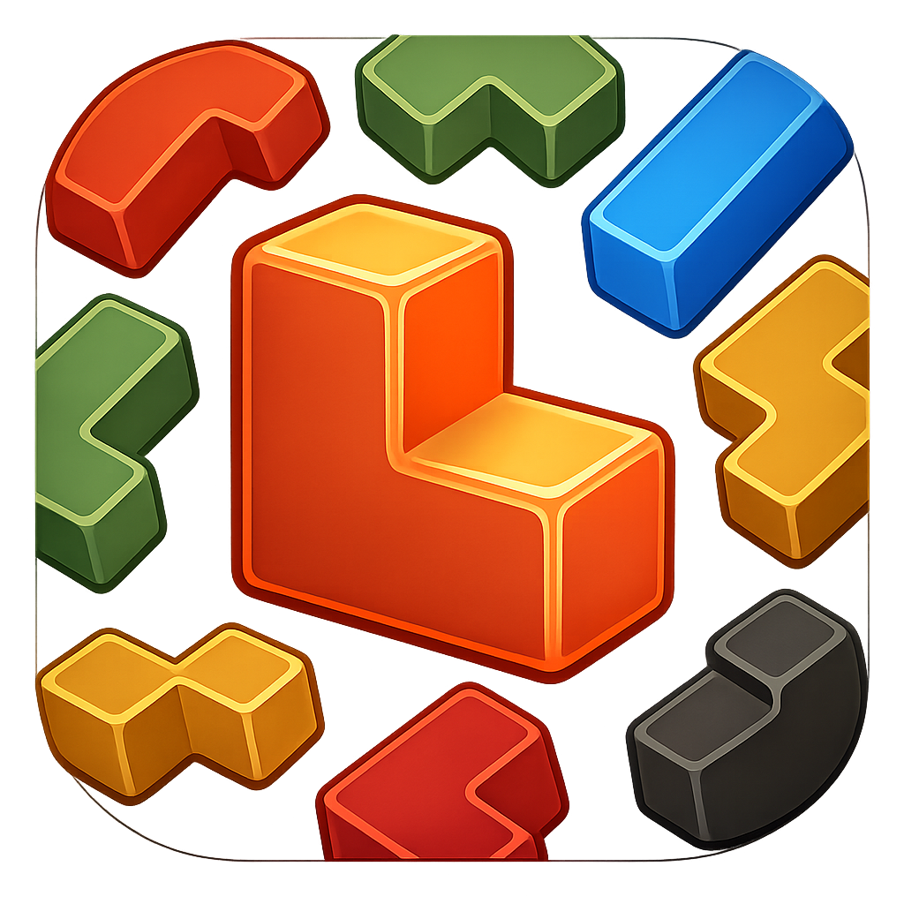
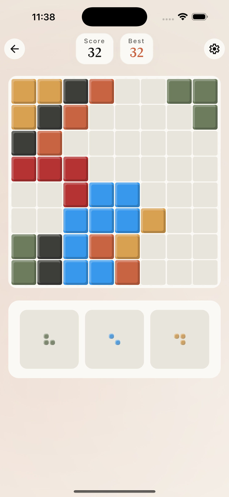
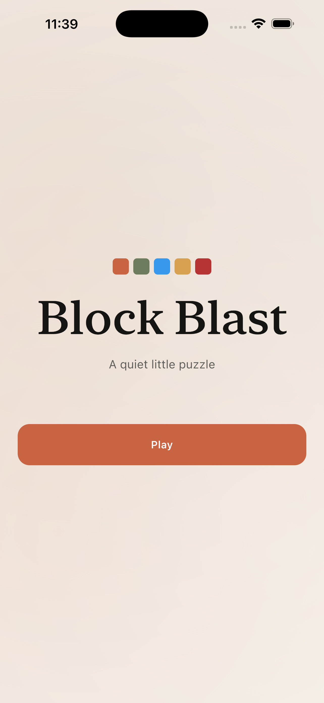
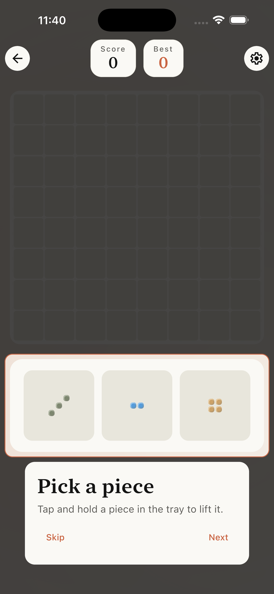
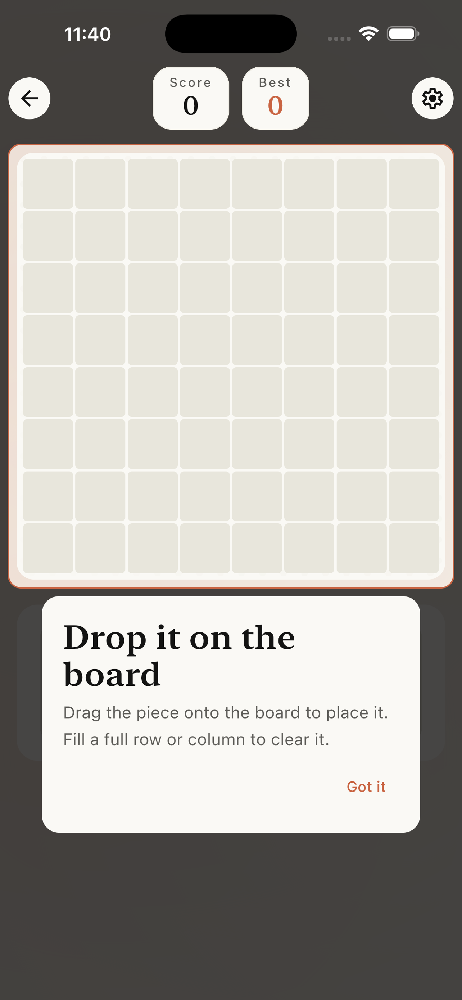

# Logica — Block Puzzle



A modern, cross-platform block puzzle game built with **Kotlin Multiplatform** and **Compose Multiplatform**, sharing code between Android and iOS.


## Download

<a href="https://apps.apple.com/us/app/logica-block-puzzle-2027/id6765924581">
  
</a>

<a href="https://play.google.com/store/apps/details?id=ge.yet.blokblast">
  
</a>

## Screenshots

<p>
  
  
  
  
</p>

## Features

- 🧩 Classic block-puzzle gameplay with smooth animations
- 🎨 Polished Material 3 UI tuned for the Block Blast feel
- 📱 Single codebase for Android & iOS via Compose Multiplatform
- 💾 Persistent settings and best-score tracking
- 🎉 Confetti effects on big clears
- 🎵 Rotating background music across multiple tracks
- 📴 Fully offline — no account required
- ⭐ In-app review prompts on Android
- 📊 Firebase Analytics & Crashlytics

## Tech Stack

- **Kotlin Multiplatform** 2.3.21 — shared business logic
- **Compose Multiplatform** 1.10.3 — declarative UI for Android & iOS
- **Material 3** — design system
- **Decompose** + **Essenty** — navigation & lifecycle
- **MVIKotlin** — predictable state management (MVI)
- **Metro DI** — compile-time dependency injection
- **Kotlinx Coroutines / Serialization / Datetime**
- **Multiplatform Settings** — cross-platform key/value storage
- **Firebase** (GitLive SDK) — Analytics, Crashlytics
- **Google Mobile Ads** + **User Messaging Platform** (Android)
- **ConfettiKit** — celebratory effects
- **Baseline Profiles** — Android startup performance

## Project Structure

```
BlockBlast/
├── androidApp/      # Android entry point (Activity, manifest, ads, Firebase)
├── iosApp/          # iOS entry point (SwiftUI host)
├── composeApp/      # Shared Compose UI (commonMain, androidMain, iosMain)
├── core/
│   ├── common/      # Common utilities
│   ├── domain/      # Business logic, models, use cases
│   └── data/        # Repositories, persistence
├── feature/
│   ├── root/        # Navigation root
│   ├── home/        # Home screen
│   ├── game/        # Game screen and logic
│   └── settings/    # Settings
├── build-logic/     # Convention plugins for Gradle
└── fastlane/        # Store metadata & changelogs
```

## Getting Started

### Prerequisites
- **JDK 17+**
- **Android Studio** Ladybug or later
- **Xcode 15+** (iOS, macOS only)
- Your own Firebase project — see below

### Firebase setup

This repo does **not** ship Firebase config files. Create your own Firebase project and drop in:

- `androidApp/google-services.json`
- `iosApp/iosApp/GoogleService-Info.plist`

### Build and Run

#### Android

```bash
./gradlew :androidApp:assembleDebug
./gradlew :androidApp:installDebug
```

#### iOS

Open `iosApp/iosApp.xcodeproj` in Xcode and run.

## Development

### Tests

```bash
./gradlew test
```

## Contributing

Contributions are welcome! Feel free to open an issue or submit a PR.

## Support Me
- **ton**: UQCi1XMdZP2fBfTK-O6rsAX3fXEm5iBpjO1D6FDekdUDQnaw
- **btc**: bc1qv2m03vg23227yfnlu0c0jx2ps5yg8v8kvy748s
- **eth**: 0xdF196759E996Fe684c33416282F30d6B9A0b325e
- **usdt(erc20)**: 0xdF196759E996Fe684c33416282F30d6B9A0b325e
- **bnb**: 0xdF196759E996Fe684c33416282F30d6B9A0b325e
- **usdt(trc20)**: TYrBMc4yN4k8im2Qq2G17hv9VdmcYFngpT

## License

This project is open source and available under the MIT License.

## Learn More

- [Kotlin Multiplatform](https://www.jetbrains.com/kotlin-multiplatform/)
- [Compose Multiplatform](https://www.jetbrains.com/lp/compose-multiplatform/)
- [MVIKotlin](https://github.com/arkivanov/MVIKotlin)
- [Decompose](https://github.com/arkivanov/Decompose)
- [Metro](https://github.com/ZacSweers/metro)
