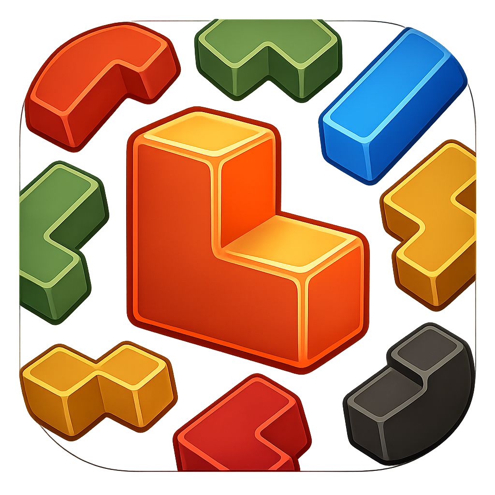
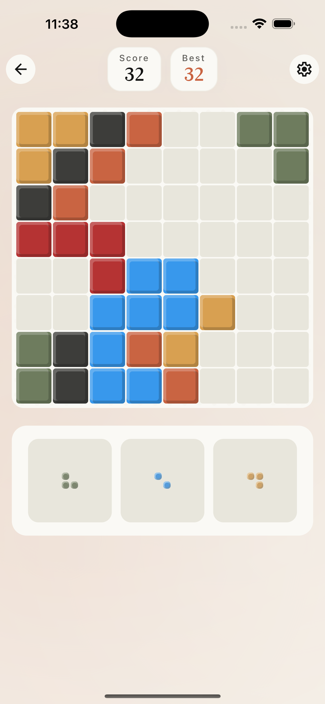
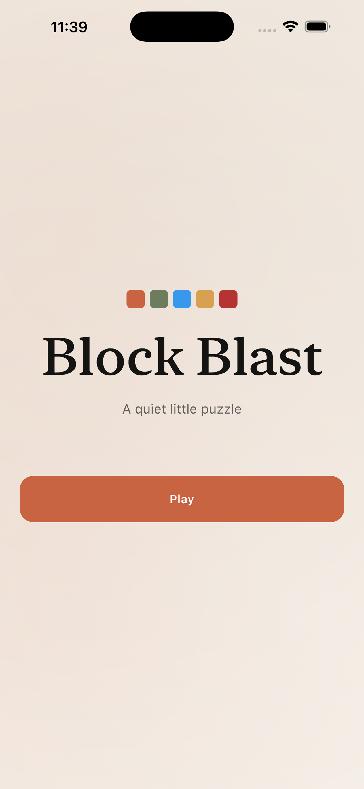
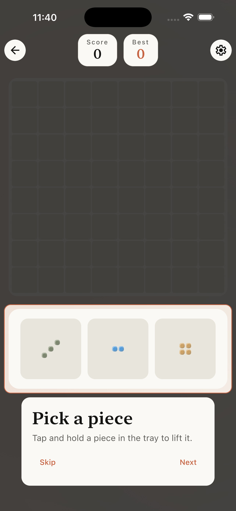
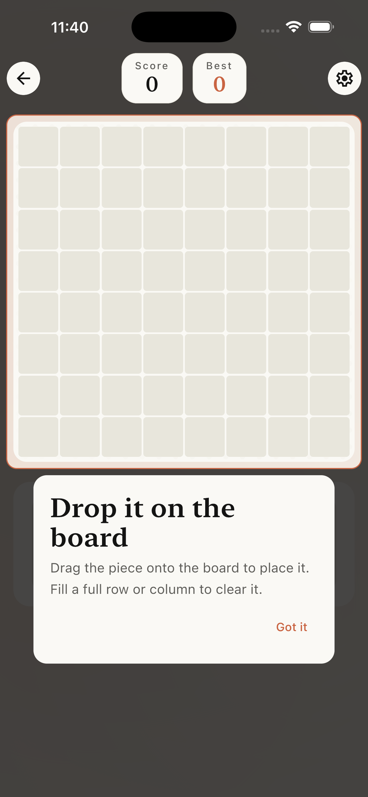

# Logica — Block Puzzle



A Kotlin Multiplatform MiniApp catalog for Android and iOS. The production
build currently ships Block Blast; additional games and apps are independent
Gradle modules reviewed and allowlisted at build time.


## Download

<a href="https://apps.apple.com/us/app/logica-block-puzzle-2027/id6765924581">
  
</a>

<a href="https://play.google.com/store/apps/details?id=ge.yet.blokblast">
  
</a>

## Screenshots

<p>
  
  
  
  
</p>

## Features

- 🧩 Classic block-puzzle gameplay with smooth animations
- 🎨 Polished Material 3 UI tuned for the Block Blast feel
- 📱 Single codebase for Android & iOS via Compose Multiplatform
- 💾 Persistent settings and best-score tracking
- 🎉 Confetti effects on big clears
- 🎵 Rotating background music across multiple tracks
- 📴 Fully offline — no account required
- ⭐ In-app review prompts on Android
- 📊 Firebase Analytics & Crashlytics
- 🧱 Compile-time MiniApp plugin framework with a uniform catalog and host frame
- 🔌 Contributor games discovered locally and shipped only through reviewable allowlisting

## Tech Stack

- **Kotlin Multiplatform** 2.4.10 — shared business logic
- **Compose Multiplatform** 1.11.1 — declarative UI for Android & iOS
- **Material 3** — design system
- **Decompose** + **Essenty** — navigation & lifecycle
- **MVIKotlin** — predictable state management (MVI)
- **Metro DI** — compile-time dependency injection
- **Kotlinx Coroutines / Serialization / Datetime**
- **Multiplatform Settings** — cross-platform key/value storage
- **Firebase** (GitLive SDK) — Analytics, Crashlytics
- **Google Mobile Ads** + **User Messaging Platform** (Android)
- **ConfettiKit** — celebratory effects
- **Baseline Profiles** — Android startup performance

## Project Structure

```
BlockBlast/
├── androidApp/      # Android entry point (Activity, manifest, ads, Firebase)
├── iosApp/          # iOS entry point (SwiftUI host)
├── composeApp/      # Shared host UI, MiniApp frame and platform composition
├── core/
│   ├── common/      # Shared utilities
│   ├── domain/      # Reusable domain contracts
│   ├── data/        # Settings and shared repositories
│   └── telemetry/   # Analytics and crash facade
├── feature/
│   ├── catalog/     # Registry-backed MiniApp catalog
│   ├── root/        # Catalog/running navigation and host lifecycle
│   ├── review/      # App review policy
│   └── settings/    # Host settings
├── game/
│   └── blockblast/  # Shipped Block Blast MiniApp
├── miniapp/
│   ├── api/         # Stable Compose-free contracts
│   ├── compose/     # Plugin, manifest, session and frame contracts
│   ├── metro/       # Registry and retained child-graph foundation
│   ├── bundle/      # Production allowlisted plugins
│   ├── testkit/     # Contributor contract fixtures
│   └── samples/     # Discovered but unshipped examples
├── build-logic/     # MiniApp discovery, scaffold and convention plugins
└── fastlane/        # Store metadata & changelogs
```

## Getting Started

### Prerequisites
- **JDK 17+**
- **Android Studio** Ladybug or later
- **Xcode 15+** (iOS, macOS only)
- Your own Firebase project — see below

### Firebase setup

This repo does **not** ship Firebase config files. Create your own Firebase project and drop in:

- `androidApp/google-services.json`
- `iosApp/iosApp/GoogleService-Info.plist`

### Build and Run

#### Android

```bash
./gradlew :androidApp:assembleDebug
./gradlew :androidApp:installDebug
```

#### iOS

Open `iosApp/iosApp.xcodeproj` in Xcode and run.

## Development

### Tests

```bash
./gradlew test
```

### Create a game / MiniApp

If you are a human contributor or an AI agent and the request is to create,
add or port a game, start with the official scaffold workflow below. Do not
create an arbitrary Gradle module and do not add the game to the production
allowlist automatically.

```bash
./gradlew createMiniApp -PminiAppId=game.snake -PminiAppName=Snake
./gradlew :game:snake:allTests :game:snake:validateMiniAppDependencies
```

The first command creates reviewable source. The next Gradle invocation
discovers `game/*` and `miniapp/samples/*`, but discovery does not ship a
plugin. After review, a maintainer adds exactly one matching entry to the root
`miniApps` allowlist. The catalog is compiled into the app; there is no server,
runtime download or remote code loading.

The stable policy and rationale are recorded in
[ADR-0001: MiniApp Contribution and Shipping Workflow](docs/adr/0001-miniapp-contribution-and-shipping.md).
The current agent-level architecture and verification rules are in
[AGENTS.md](AGENTS.md). Detailed human and AI contributor guides will follow
the approved [contributor pipeline design](docs/superpowers/specs/2026-08-23-miniapp-contributor-pipeline-design.md).

Plugins depend only on MiniApp contracts, approved inward core contracts and
typed host capabilities. Root owns Catalog/Running navigation, Back,
Settings/Review, visibility and stale-callback protection. The common frame
owns catalog cards, toolbar controls and ad containers; Replay is intentionally
not part of the initial plugin API.

Use `MiniAppId.storageKey(localName)` for new persistence. Block Blast's legacy
keys remain unchanged for save compatibility.

## Contributing

Contributions are welcome. MiniApps generated by the command above remain
unshipped until their source, dependency boundary and allowlist change are
reviewed.

## Support Me
- **ton**: UQCi1XMdZP2fBfTK-O6rsAX3fXEm5iBpjO1D6FDekdUDQnaw
- **btc**: bc1qv2m03vg23227yfnlu0c0jx2ps5yg8v8kvy748s
- **eth**: 0xdF196759E996Fe684c33416282F30d6B9A0b325e
- **usdt(erc20)**: 0xdF196759E996Fe684c33416282F30d6B9A0b325e
- **bnb**: 0xdF196759E996Fe684c33416282F30d6B9A0b325e
- **usdt(trc20)**: TYrBMc4yN4k8im2Qq2G17hv9VdmcYFngpT

## License

This project is open source and available under the MIT License.

## Learn More

- [Kotlin Multiplatform](https://www.jetbrains.com/kotlin-multiplatform/)
- [Compose Multiplatform](https://www.jetbrains.com/lp/compose-multiplatform/)
- [MVIKotlin](https://github.com/arkivanov/MVIKotlin)
- [Decompose](https://github.com/arkivanov/Decompose)
- [Metro](https://github.com/ZacSweers/metro)
